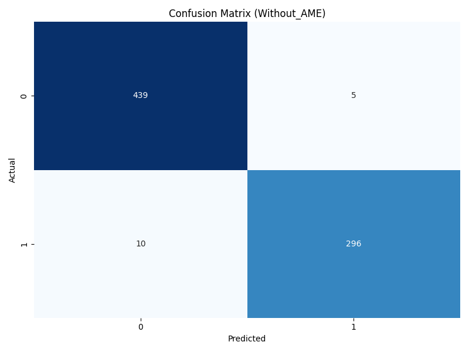

# Project Overview

This project originates from the Kaggle notebook: [PyTorch RNN ECG5000](https://www.kaggle.com/code/alfredkondoro/pytorch-rnn-ecg5000). 

The primary objective of this project is to investigate whether the **AME (Adaptive Multimodal Enhancement) module** can be extended to work with modalities beyond the typical language, audio, and vision modalities commonly used in Multimodal Sentiment Analysis (MSA). To achieve this, we modified and tested the original project.

## How to Run
To execute the project, simply run the `main.py` file.

## Results
### Without AME Module
- **Test Accuracy**: 98.0%
- **Confusion Matrix**:
  

### With AME Module
- **Test Accuracy**: 99.2%
- **Confusion Matrix**:
  

These results demonstrate that the AME module effectively enhances physiological signal features through **adaptive frequency feature fusion**, showcasing its adaptability to a broader range of multimodal tasks beyond traditional modalities.